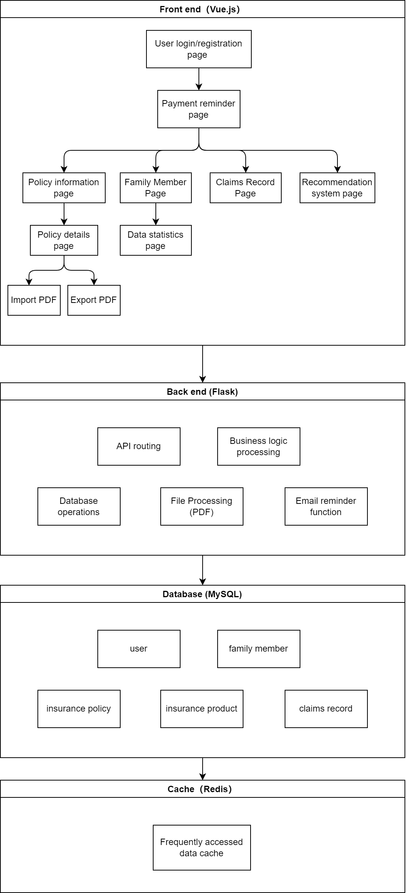
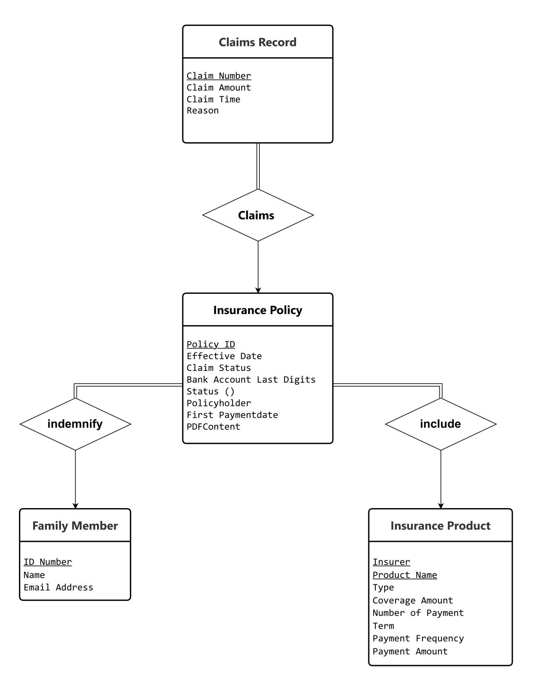
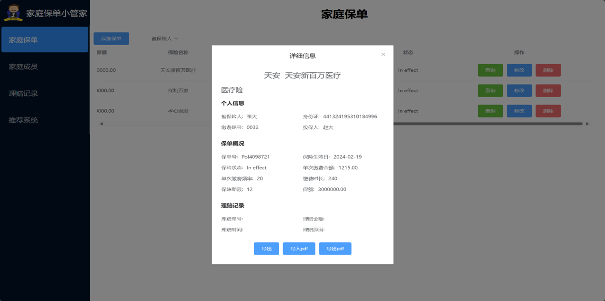

# 数据库大作业/家庭保单小管家

## 项目简介

"Family Policy Manager" 家庭保单小管家是一款保险单管理系统，通过详细的需求分析，我们设计了以下功能来提升用户体验，使保单管理变得简单高效。

### 核心功能

**（1）基础CRUD操作**  
作为系统基础功能，提供完整的创建、读取、更新和删除（CRUD）操作，确保用户对保单数据的完全控制，支持基本的保单管理需求。

**（2）智能保险提醒**  
- 缴费提醒：通过电子邮件通知用户即将到期的保费支付，避免因逾期付款导致的保单失效
- 保障到期提醒：及时提醒用户续保或调整保障方案

**（3）个性化配置推荐**  
根据用户现有保单详情和市场情况，智能推荐性价比更高的保险产品或保障调整方案。

**（4）数据统计与可视化**  
- 以图表形式展示总保额和保单分布情况
- 帮助用户直观了解和分析保险状况及财务责任
- 辅助用户做出更明智的保险决策

**（5）文档保存功能**  
- PDF存档：支持用户上传本地PDF保单文件至网站
- 方便打印或电子归档
- 提供安全便捷的数据备份和转移方式
- 便于离线查看或与家人共享保单信息

## 技术实现
- 前端：Vue.js 
- 后端：Spring Boot
- 数据库：MySQL

*图1：系统概述图*

*图2：数据库E-R关系图*

*图3：保单详情展示界面*
